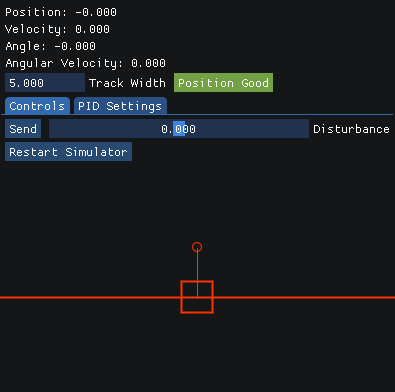

# Inverted Pendulum Simulator
### Introduction
This is my attempt at solving the vention inverted pendulum take home exam

The solution is split into three seperate executables to somewhat emulate a real world scenerio. The simulation is taking the place of real world hardware, the controller is running on a seperate device and the HMI is independent from the controller allowing it to be updated while maintaining stability.

There are two HMI versions V1 and V2, As project requirements were updated after the initial version a second version with added controls and warnings was implemented.

<p align=center>
  
</p>

<p align="center">
    HMI Interface
</p>

### Dependencies
The following dependencies are required to run the full sim + controller + HMI

- [Boost](https://github.com/boostorg/boost) specifically Boost::interprocess for IPC communication
- [ImGui](https://github.com/ocornut/imgui) HMI (already in the repo no action required)
- [Eigen3](https://eigen.tuxfamily.org/index.php?title=Main_Page) Vector math library 
- [glfw3](https://www.glfw.org/) 
- [opengl](https://www.opengl.org/) 
- [cmake](https://cmake.org/) 
- [clang](https://clang.llvm.org/) 

Dependencies can be installed using
```./scripts/install-dependencies.sh```

### Docker
With the use of docker and docker compose the entire system can be run containerized with:

First ensure that the container has display access:

``` xhost +local:* ```

then all three process including hmi v1 can be launched:

```docker compose up```

Alternatively individual processes can be launched:

``` docker build -t pendulum . ```

``` docker run -it --ipc=host -v /tmp/.X11-unix:/tmp/.X11-unix -v /dev/shm:/dev/shm -e DISPLAY=$DISPLAY pendulum bash -c "./build/hmi_v2" ```

### Native
##### Building
Building is done using the script
```./scripts/build_compile.sh```

##### Running
This project is run in two parts and must be launched in order:
1. Launch the backend (sim + controller first) using:

```./scripts/launch-backend.sh```

2. Launch either HMI v1 or v2 using:

```./scripts/launch-hmi-v1.sh``` or ```./scripts/launch-hmi-v2.sh```

### Originality
As this is meant as a take home exam I will list borrowed code here.

The imgui setup code (hmi.hpp GlfwInit) was taked from examples.

The inverted_pendulum.cpp was based on an existing project found [here](https://github.com/jasleon/Inverted-Pendulum) with the equations being modified and the overall code being updated to meet more modern C++ standards. 

### Future Potential Updates
- Tests and ideally a ci/cd pipeline with linting and static analysis
- Alternative controller implementations (LQR)
- Socket based communication between the Sim and Controller
- Expanding HMI functionality and usability
